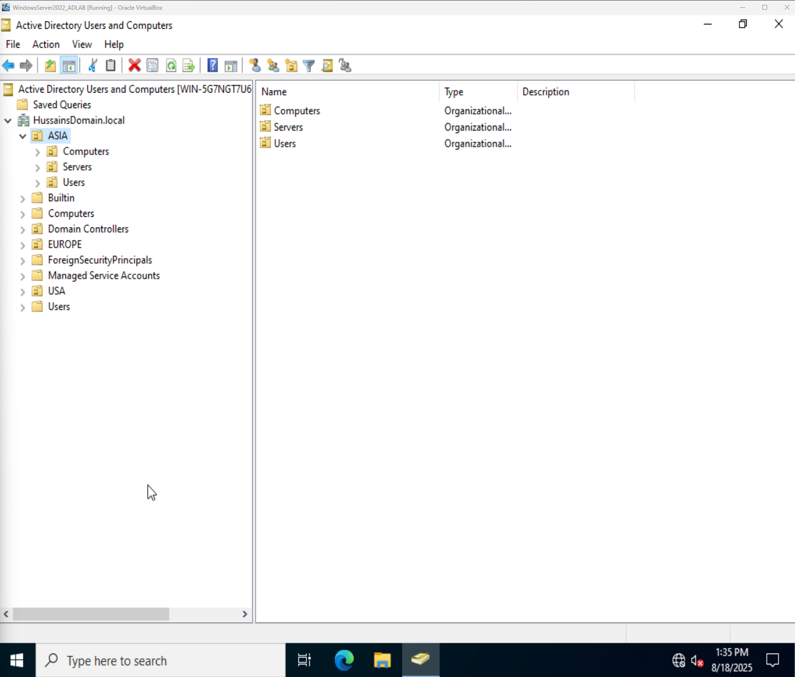
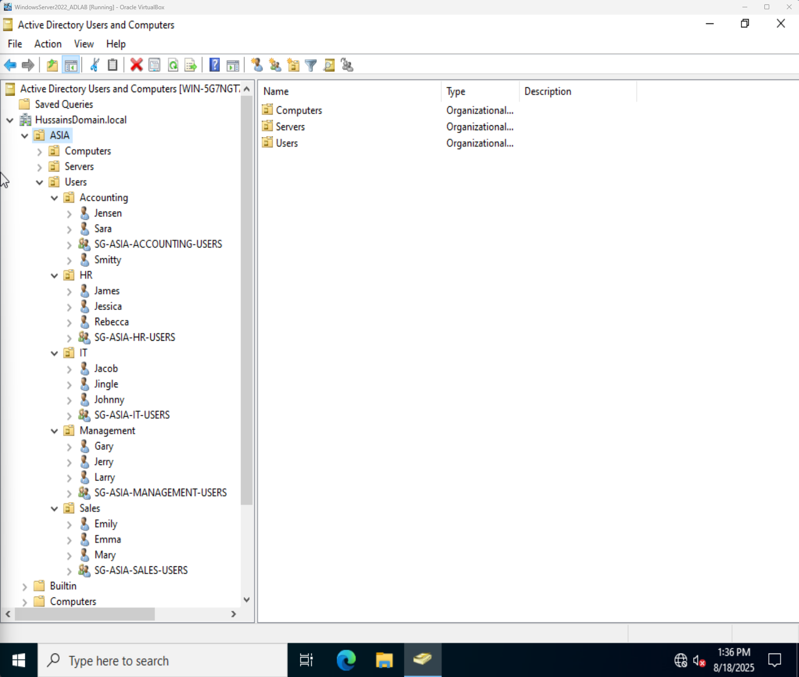
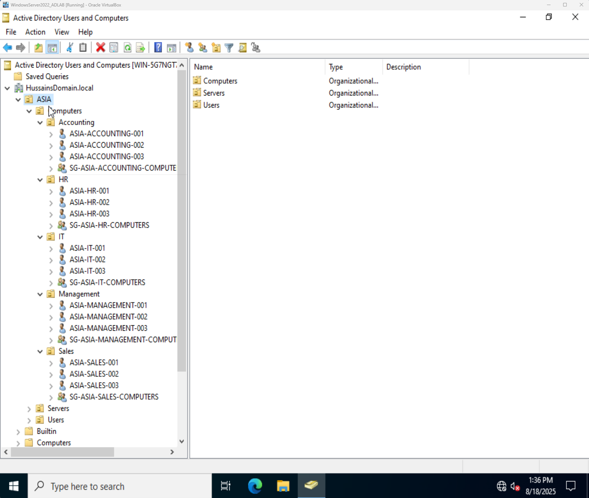
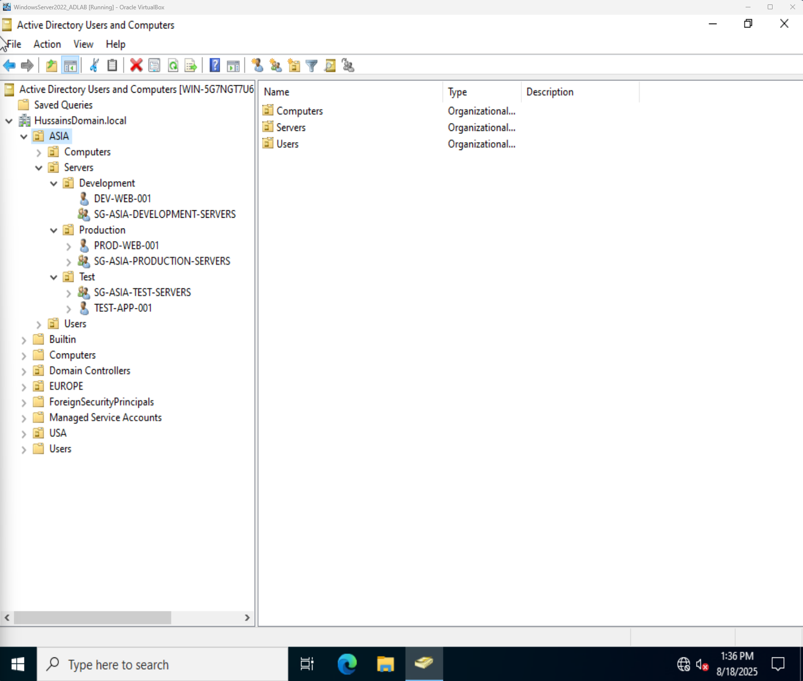

# Active Directory Lab: Asia Region
*A professional portfolio project demonstrating the setup and security of a regional Active Directory network.*

### **Project Objective**
The goal of this project was to simulate a real-world enterprise environment by building a complete Active Directory tree for the Asia region. I implemented best practices for user and group management, ensuring a scalable and secure infrastructure.

### **Key Skills Demonstrated**
* **Organizational Unit (OU) Management:** Designed a logical hierarchy to organize users, computers, and servers by department and function.
* **Identity and Access Management (IAM):** Created and managed user and group accounts, ensuring a clear separation of roles and responsibilities.
* **Group Policy Objects (GPO):** Applied a universal password policy to all users in the region to enforce security standards.
* **Professional Naming Conventions:** Used a clear and consistent naming scheme for all objects to enhance administrative clarity.

### **Visual Documentation**
* **Active Directory Tree Structure**
    
    * *This shows the top-level structure of the Active Directory network, organized by region and function.*

* **Users & Group Management**
    
    * *This demonstrates the principle of least privilege by showing user accounts assigned to their appropriate groups.*

* **Computer Management**
    
    * *This shows the organization of computer accounts by department, which is a key skill for managing system policies.*

* **Server Management**
    
    * *This proves my ability to manage servers by function and apply different security controls to different environments.*

---

### **Reflection**
This lab provided me with invaluable hands-on experience in the critical role of identity and access management. I learned not only how to manage user accounts but also how to secure them at a fundamental level, which is a key skill for any aspiring cybersecurity professional.
